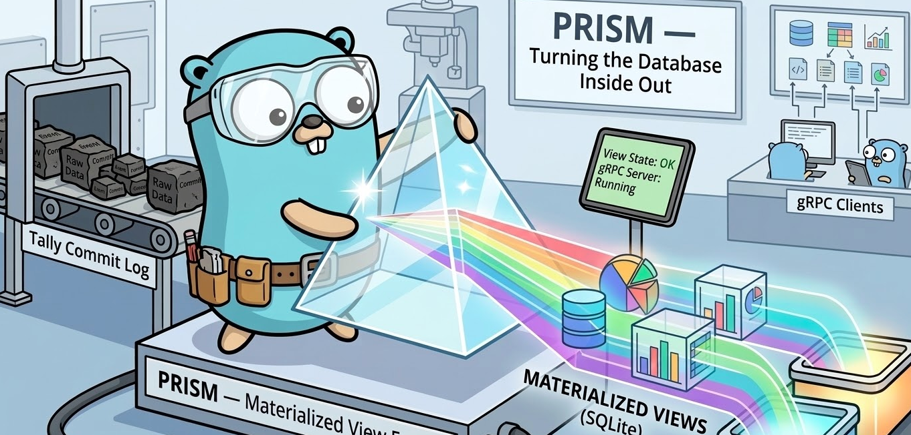
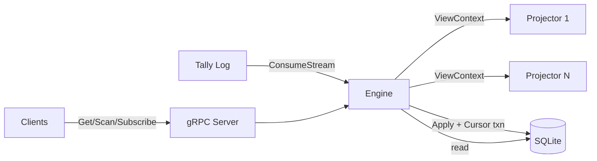

# Prism

  

## Problem

A commit log captures raw events, but consumers need derived state -- aggregations, latest values, filtered subsets. Today consumers of the [tally](https://github.com/w-h-a/tally) commit log have to write hand-rolled offset tracking, state management, recovery logic, and queries. Every consumer re-invents the same infrastructure. 

## Solution

Prism is the materialized view engine for tally. You define projections as Go handlers, register them with the engine, and run. Prism connects to tally, consumes the log, applies your handlers, maintains view state in local SQLite, and serves views over gRPC.

Together, tally and prism implement Kleppmann's "turning the database inside out". Tally is the write path (the log), and prism is the read path (the derived views).

## Architecture

## Usage

Coming soon!